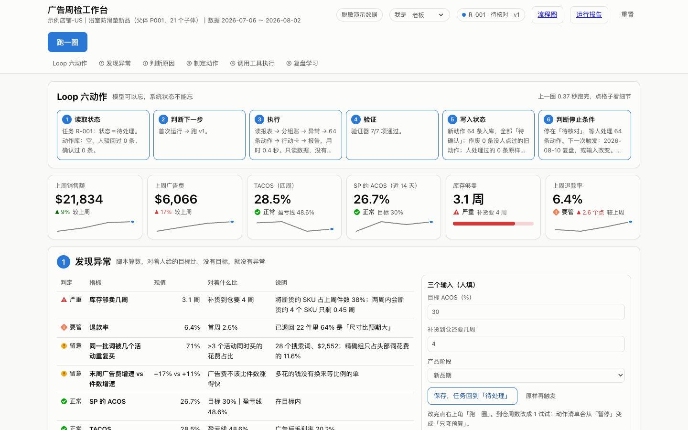

## 🚀 Way to AIC | 通往 AI 电商之路
---
### 🌐 官网 Website
- https://waytoaic.com
- https://www.waytoaic.com
---

### 👥 社群招募 Community
`Way to AIC 社群招募 | WaytoAIC.com`

<p align="center">
  
</p>

---

### 📣 公众号 WeChat Official Account
`维正 WaytoAIC`

<p align="center">
  
</p>

---

### 🧠 知识星球 Xiaozhixing
`AI电商之路 WaytoAIC`

<p align="center">
  
  
</p>

---

### 🧩 About Way to AIC

**AIC = AI Commerce**

在 AI 重塑商业的时代，我们希望和每一个拥抱 AI 的卖家：

- 找到场景
- 定义问题
- 积累能力
- 设计系统

共同通往 AI 电商之路。

> Way to AIC 不是教学，不是工具，
> 而是一条所有电商人共同走的进化之路。

### WaytoAIC 理念 | Principles

| 中文 | English |
|---|---|
| 场景先于方法 | Context before method |
| AI 的价值来自真实业务场景，而不是技术本身。 | AI creates value through real business contexts, not through technology alone. |
| 问题先于答案 | Problem before answer |
| 定义问题，比拥有工具更重要。 | Defining the problem matters more than collecting tools. |
| 系统胜过技巧 | System over tricks |
| 技巧是术，系统才是道，决定卖家的上限。 | Tricks are tactical; systems define long-term leverage and ceiling. |
| 共创优于独行 | Co-creation over solo progress |
| 我们相信，真正的进化发生在共同探索的过程中。 | Real evolution happens through shared exploration. |

# ads-workbench · 广告周检本地工作台 / Local Ads Review Workbench

一个能点、能跑的本地工作台：把「看到 ACOS 高」推进到「有人点头、有日期、能复盘的动作清单」。只用 Python 标准库＋SQLite＋pandas，断网可用，**不连任何广告后台**。

A runnable local workbench that turns an Amazon ads report into a reviewed, dated action list. Python stdlib + SQLite + pandas, works offline, **never touches your ad console**.



## 快速开始 / Quick start

```bash
git clone https://github.com/WaytoAIC/ads-workbench ~/ads-lab
cd ~/ads-lab && pip install pandas && python3 工作台/app.py
```

打开 http://localhost:8810 ，点「跑第一圈」。Mac 也可以双击 `启动工作台.command`。不要放在「桌面」目录下。
Open http://localhost:8810 and click “跑第一圈”.

## 里面有什么 / What's inside

- **Loop 六动作**：读取状态 → 判断下一步 → 执行 → 验证 → 写入状态 → 判断停止条件（`流程图/`）
- **五步**：发现异常 → 判断原因（事实／推断／未知）→ 制定动作（五条路各带代价）→ 调用工具执行（确认／驳回必填理由）→ 复盘学习
- 权限与状态流转在服务端强制；改一个输入再跑，输出跟着变；人驳回过的下一圈不再提
- `实操手册.html`：学员 18 步（Codex 版，带截图）｜`台上操作卡-业务工作台.md`：讲师 7 步｜`数据说明.md`
- 换成自己的数据：`数据格式.md` ＋ 模板 `我的数据-示例/` ＋ `python3 _脚本/import_my_data.py 我的数据 ~/ads-lab-mine`

Six-step loop, five-stage review page, server-enforced roles and state transitions, a student handbook and an instructor card. UI and docs are in Chinese.

## 数据 / Data

示例是脱敏并替换过品类的演示数据（浴室防滑垫／NORDLY），竞品品牌名全部是编的。换成自己的数据：照 `数据格式.md` 准备一份搜索词报告加三张手填小表，导入后 `python3 工作台/app.py --root <目录>`；真实数据只留在你自己电脑上。
Sample data is desensitized demo data with a substituted category; all competitor brand names are fictional.

## License

MIT
